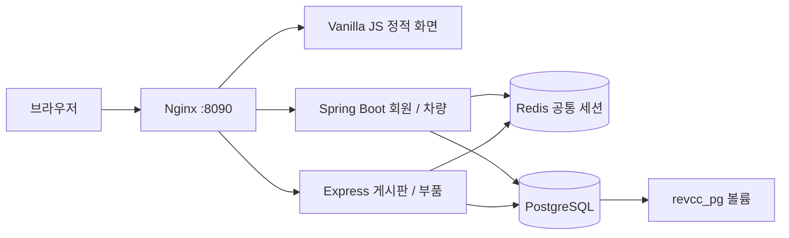

# REV.CC Docker 과제

## 분석 및 구현 범위

기존 프로젝트는 `frontend/` Next.js 개인 화면, `backend/` Spring Boot API,
`prototype/` 정적 시안으로 구성되어 있었다. 기존 차량 API는 차량 2대를 반환하며,
회원가입은 JPA User/UserRepository로 PostgreSQL에 저장한다.
최초 작업 시 과제용 디렉터리들은 빈 상태였고 Compose에는 PostgreSQL·Redis만 있었다.
추가 제출 요구를 반영하여 차량도 PostgreSQL vehicles 테이블에서 조회하도록 보완했다.
초기 차량 2대는 ON CONFLICT DO NOTHING으로 넣어 기존 데이터를 덮어쓰지 않는다.

`docker-assignment`에서 기존 회원가입과 차량 응답을 유지하면서 로그인과 공유 세션을
추가했다. `frontend/`와 `prototype/`는 수정하지 않았다.

## 제출 명령어 안내

[Docker build/run, Docker Hub, 교수님 시연 절차](docs/DOCKER-SUBMISSION.md)를 함께 확인한다.

## 실행

Docker Desktop이 실행된 상태에서 프로젝트 루트에서:

```sh
docker compose up -d --build --wait
# http://localhost:8090 접속
docker compose ps
```

8090 포트를 다른 프로그램이 사용하면 `REVCC_PORT=8091 docker compose up -d --build --wait`로
실행하고 http://localhost:8091 에 접속한다. 호스트 Java/Node 설치 없이 실행 가능하다.
기본 DB 계정은 과제 로컬 실행용 `revcc/revcc`이다.
`POSTGRES_PASSWORD`를 변경해도 이미 초기화된 DB의 비밀번호는 자동 변경되지 않는다.

## 6개 컨테이너

| 컨테이너 | 역할 | 내부 포트 |
| --- | --- | --- |
| revcc-proxy | Nginx 단일 진입점 | 80 → 호스트 8090 |
| revcc-frontend | Nginx로 HTML/CSS/Vanilla JS 제공 | 80 |
| revcc-core | Spring Boot 3.5 / Java 23, 회원·차량 | 8080 |
| revcc-board | Node.js 22 / Express, 게시판·부품 | 3001 |
| revcc-redis | Redis 7, 공유 로그인 세션 | 6379 |
| revcc-postgres | PostgreSQL 16, 회원·차량·게시글 영속화 | 5432 |



Compose 내부 DNS 이름 `core`, `board`, `frontend`, `redis`, `postgres`로 통신한다.
Nginx는 Docker DNS(127.0.0.11)를 5초 간격으로 재조회하여 재시작 후 IP 변경을 반영한다.
기본 구성은 proxy에만 호스트 포트를 공개한다.

## Redis 공유 세션 계약

1. Spring이 PostgreSQL 계정의 비밀번호를 BCrypt로 검증한다.
2. 32바이트 난수의 Base64URL 토큰(43자)을 발급한다.
3. Redis 문자열 키 `revcc:session:<token>`에 `{"id":1,"username":"owner"}`를 저장한다.
4. Redis TTL과 `REVCC_SESSION` 쿠키 Max-Age는 1800초이며 요청 시 연장하지 않는다.
5. 쿠키는 `Path=/; HttpOnly; SameSite=Lax`이다. TLS 환경은 `SESSION_COOKIE_SECURE=true`를 지정한다.
6. Express는 같은 쿠키로 Redis JSON을 직접 읽는다. 별도의 Express 세션을 발급하지 않는다.
7. 재로그인은 기존 토큰을 삭제하고 새 토큰을 발급한다. 로그아웃은 Redis 키와 쿠키를 삭제한다.

Spring Session의 Java 직렬화와 express-session의 저장 형식은 자동 호환되지 않으므로
Spring Session 의존성 대신 `StringRedisTemplate`으로 공통 계약을 구현했다.
Redis 장애 시 인증을 우회하지 않는다. Redis 재생성 시 로그인은 다시 해야 하며
회원·게시글은 PostgreSQL 볼륨에 남는다.

새 계정 비밀번호는 BCrypt로 저장한다. 기존 평문 계정은 정상 로그인 시 BCrypt로 이전한다.
기존 평문 비밀번호가 UTF-8 72바이트를 넘으면 별도 비밀번호 변경이 필요하다.
Nginx는 변경 요청에 JSON을 요구하고 CORS를 개방하지 않으며 쿠키 SameSite와 함께 CSRF를 제한한다.
게시글 작성자는 요청의 authorId가 아니라 Redis에서 결정하고 SQL은 매개변수로 전달한다.
화면은 사용자 콘텐츠를 `textContent`로 렌더링한다.

## API 및 화면 시연

| 메서드·경로 | 설명 | 로그인 |
| --- | --- | --- |
| POST /api/auth/signup | `{username,password}` 가입, 201/409/400 | 불필요 |
| POST /api/auth/login | 로그인 및 공통 쿠키 발급 | 불필요 |
| GET /api/auth/me | Spring이 확인한 `{id,username}` | 필요 |
| POST /api/auth/logout | `{}` 전송, 세션 삭제 | 불필요 |
| GET /api/vehicles | 기존 차량 목록 유지 | 불필요 |
| GET /api/board/me | Express가 확인한 동일 사용자 | 필요 |
| GET /api/board/posts | 최신 게시글 최대 100개 | 불필요 |
| POST /api/board/posts | `{title,content}` 게시글 등록 | 필요 |
| GET /api/parts/compatibility?vehicleId=1 | 차량별 예시 부품 조회, 1 또는 2 | 불필요 |

화면에서 가입 → 로그인 → 두 서비스 사용자 이름 일치 확인 → 게시글 등록 → 차량 선택 →
로그아웃 순서로 시연한다. 부품 호환은 과제용 고정 예시 데이터이며 실제 부품 카탈로그가 아니다.

## 빌드와 테스트

```sh
# Dockerfile이 Java 테스트와 Node 테스트를 실행하고 성공해야 빌드된다.
docker compose build
python3 scripts/assignment-smoke.py
# 서비스 재시작과 DB 컨테이너 재생성을 포함하는 검사 (볼륨 유지)
python3 scripts/assignment-system.py
# 포트를 변경했다면:
REVCC_URL=http://localhost:8091 python3 scripts/assignment-smoke.py

# 선택적으로 로컬 단위 테스트 실행
mvn -f backend/pom.xml verify
cd board-service
npm ci
npm test
```

HTTP 테스트는 고유한 `smoke_*` 회원과 게시글 하나를 만들어 보존한다.
회원가입/중복/잘못된 입력/로그인 실패/쿠키/양쪽 사용자 일치/토큰 회전/작성자 위조 방지/
부품 조회/로그아웃 후 이전 쿠키 거부를 검증한다.
Mockito 테스트는 샌드박스의 JVM attach 제한을 피하도록 subclass mock maker를 사용한다.

## 영속화 확인 및 종료

기존 Compose 서비스명 `postgres`와 `revcc_pg` 볼륨 키를 유지했다.
이 작업 폴더에서는 `revcc-site_revcc_pg`를 재사용한다. 프로젝트 이름(`-p`)을 변경하면
다른 볼륨을 사용하므로 기존 데이터가 필요한 경우 동일 프로젝트 이름을 유지한다.

```sh
docker compose exec postgres psql -U revcc -d revcc -c 'SELECT id, username FROM users;'
docker compose exec postgres psql -U revcc -d revcc -c 'SELECT id, title FROM board_posts;'
docker compose up -d --force-recreate --wait postgres
# 위 SELECT를 반복하여 데이터가 유지되는지 확인
docker compose stop
# 컨테이너도 삭제하려면 docker compose down (볼륨은 유지)
```

`docker compose down -v`는 DB 볼륨까지 삭제하므로 기존 데이터를 보존하려면 실행하지 않는다.

## 기존 로컬 개발

기존 Next.js 소스와 차량 API는 유지했다. Spring을 호스트에서 실행할 때만 선택적으로
DB 개발 포트를 열 수 있다:

```sh
docker compose -f docker-compose.yml -f docker-compose.dev.yml up -d postgres redis
mvn -f backend/pom.xml spring-boot:run
# frontend/에서 기존 npm run dev 사용
```

과제 proxy의 기본 포트는 8090이므로 기존 호스트 Spring의 8080과 충돌하지 않는다.
과제 제출 구성에는 개발 override를 사용하지 않는다.

## 참고

- [Spring Data Redis StringRedisTemplate](https://docs.spring.io/spring-data/data-redis/docs/current/api/org/springframework/data/redis/core/StringRedisTemplate.html)
- [공식 Eclipse Temurin Java 23 이미지](https://hub.docker.com/layers/library/eclipse-temurin/23-jdk/images/sha256-6e0e0e96c959b23d840f93b2306ea273331ac1c96500e4b57ba14b379fe021eb)

## 실행 검증 결과 (2026-09-15)

- Java 23 Maven verify: 기존 차량 테스트 2개 + 인증 테스트 3개 통과.
- Express Node test: 공유 세션 파싱 및 작성자 위조/잘못된 요청 검증 2개 통과.
- 6개 컨테이너 모두 healthy, nginx -t 통과. 공개 포트는 proxy 8090만 사용.
- Nginx 경유 HTTP 통합 테스트 통과.
- 실제 Chrome: 가입/로그인/양쪽 사용자 표시/게시글/부품/로그아웃 통과.
  모바일 390px 가로 넘침 및 JavaScript 오류 없음, 스크립트 문자열이 실행되지 않음 확인.
- Redis JSON·TTL 만료 검증 통과. core/board 재시작 후 동일 세션 유지 확인.
- PostgreSQL 컨테이너 ID가 바뀐 뒤 전체 회원·게시글 데이터 일치 및 HTTP 재검증 통과.
- 최초 검증 오류인 런타임 curl 누락, pg BIGINT JSON 타입 차이, Nginx DNS 캐시, DB 재시작 시 Node 연결 풀 오류 처리를 수정 후 재검증.
- 기존 8080 로컬 서버와 충돌하여 과제 proxy는 8090을 기본 포트로 사용.

## 추가 제출 보완

- 차량 API는 PostgreSQL `vehicles` 테이블을 조회한다. 기존 JSON 필드와 차량 ID는 유지한다.
- 명시적인 사용자 정의 bridge `revcc-network`에 6개 컨테이너가 연결된다.
- Nginx 설정을 `revcc-proxy:assignment` 이미지에 포함하여 별도 파일 mount 없이 배포한다.
- 이미지 태그: `revcc-proxy:assignment`, `revcc-frontend:assignment`, `revcc-core:assignment`, `revcc-board:assignment`.
- 개별 build/run 및 Docker Hub 제출 안내는 `docs/DOCKER-SUBMISSION.md`에 있다.
- Docker Hub는 계정명 미확정으로 업로드하지 않았다. 로컬 이미지와 게시 명령은 준비되었다.

## 파일 변경 내역

이번 추가 보완에서 생성:

- `backend/src/main/java/com/revcc/app/VehicleRepository.java`
- `nginx/Dockerfile`
- `scripts/assignment-run.sh`
- `docs/DOCKER-SUBMISSION.md`

이번 추가 보완에서 수정:

- `backend/src/main/java/com/revcc/app/VehicleController.java`
- `backend/src/test/java/com/revcc/app/VehicleControllerTest.java`
- `docker-compose.yml`
- `assignment-frontend/index.html`, `assignment-frontend/css/style.css`
- `scripts/assignment-system.py`, `ASSIGNMENT.md`

앞선 구현을 유지하는 주요 파일:

- `backend/src/main/java/com/revcc/app/AuthController.java`, `SharedSessionService.java`, `User.java`, `UserRepository.java`
- `backend/pom.xml`, `backend/src/main/resources/application.yml`, `backend/Dockerfile`, `backend/.dockerignore`
- `backend/src/test/java/com/revcc/app/AuthControllerTest.java`, `backend/src/test/resources/mockito-extensions/org.mockito.plugins.MockMaker`
- `assignment-frontend/Dockerfile`, `assignment-frontend/js/app.js`
- `board-service/Dockerfile`, `.dockerignore`, `package.json`, `package-lock.json`, `src/app.js`, `src/server.js`, `test/app.test.js`
- `nginx/default.conf`, `docker-compose.dev.yml`, `scripts/assignment-smoke.py`, `README.md`, `.gitignore`

`frontend/`와 `prototype/`에는 변경이 없다. 회원가입 구현 등 기존 미커밋 작업도 유지했다.

추가 보완 최종 검증 결과:

- 개별 docker build 4개 성공, 모든 프로그램 이미지 linux/arm64 확인.
- 보정된 scripts/assignment-run.sh로 개별 docker run 6개 전체 기동 성공.
- 수동 실행 구성 HTTP 테스트 및 Chrome 화면 테스트 통과.
- 최종 Compose 구성 Java 5개/Node 2개 테스트 및 시스템 통합 테스트 통과.
- users/vehicles/board_posts 전체 데이터가 PostgreSQL 재시작과 재생성 후 일치.
- 기존 testuser 보존 확인. revcc-network에 6개 컨테이너 연결, 모두 healthy.
- 최종 실행 주소 http://localhost:8090. 컨테이너는 실행 상태로 유지했다.
